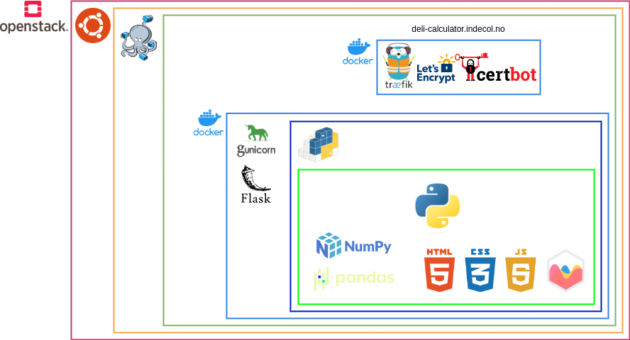

# DELI (“fooD rEcipe environmentaL Impact”) Calculator 😋🍀🧮
[https://deli-calculator.indecol.no](https://deli-calculator.indecol.no) - a web-application for comprehensive, quantitative sustainability assessment of food recipies.

Based on a research work of
* Paula Alejandra Barco Alzate
* Jeongmin Kim

led by
* Francesca Verones
* Konstantin Stadler

## Deployment info 🪲

The app lives on a VM `misc4iedlG` (access @ Bitwarden). Source directory: `/apps/deli-calculator`.
VM user (`iedl`) is configured to do git operations on behalf of a github user (`iedlWeb`).

### Deploying changes

#### - in source code

1. `ssh` to the VM
1. `cd /apps/deli-calculator/` go to the source directory
1. `git pull` fetch the changes from github
1. `cd /apps/` go where the compose configs are
1. `docker compose up --build delicalc-host -d` rebuild and redeploy the image, detach from the shell

If necessary - commit/push the source code changes to an upstream (github) repository.

#### - in data

1. ssh to the VM and find the datasets under `/apps/deli-calculator/app/backend/data`
2. make and save changes
3. rebuild and redeploy the image, as described above

### Project structure ⏫

[./misc/](./misc/) - things related to the research project, e.g. publications, (jupyter) noteboks, datasheets, illustrations

[./app/](./app/) - the app: source files, server and deployment configs etc.

### App architecture 🛠️ (tentatively)

## Contributors 🥇

Built/developed/maintained by [IEDL](https://github.com/orgs/NTNU-IndEcol/teams/iedl).
