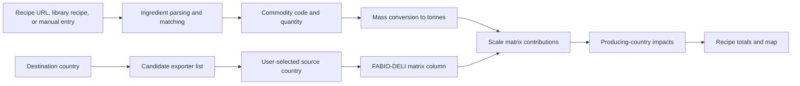
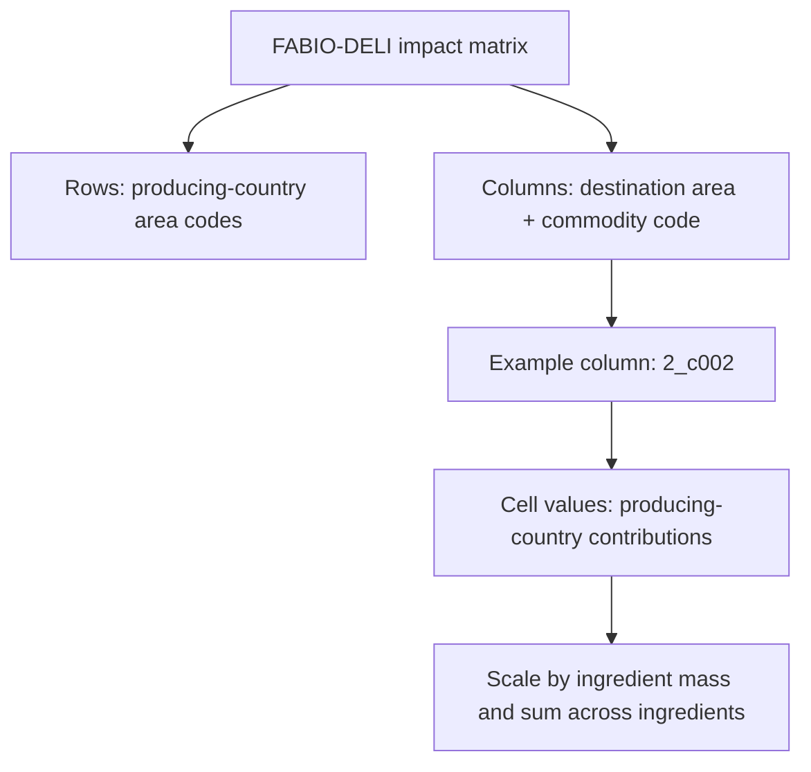
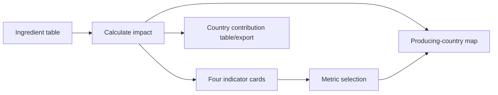
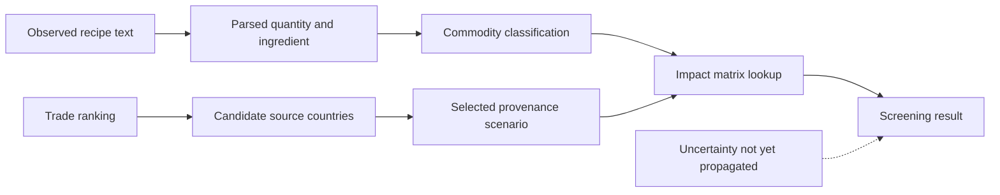
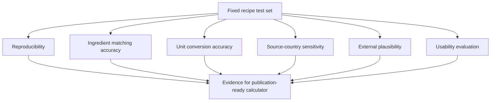

# DELI: An Interactive Recipe-Level Calculator for Multi-Indicator Food Environmental Impacts

**Working manuscript draft**

**Authors:** [Complete author list]

**Affiliations:** [Complete affiliations]

## Abstract

Food choices are made at the level of meals and recipes, while much food environmental-impact information is published at the level of commodities, supply chains, or life-cycle processes. This paper presents DELI (fooD rEcipe environmentaL Impact), an open web application that connects these levels. DELI accepts a recipe from a URL, a predefined recipe, or manual ingredient input; maps ingredients to food-system commodities; represents a selected destination country and candidate source country; and calculates recipe-level biodiversity, climate-change, water-use, and land-use impacts. Its central data structure is a set of FABIO-DELI matrices in which rows represent producing countries and columns represent destination-country and commodity combinations. For each ingredient, the selected source and quantity identify a matrix column and scale its producing-country contributions by ingredient mass. The application aggregates these contributions across ingredients and displays both total indicators and a producing-country map. This paper describes the data model, calculation workflow, software architecture, and user-facing functionality. We discuss the application as a transparent screening and decision-support tool, including important limitations related to ingredient matching, assumed provenance, unit conversion, uncertainty, and the absence of preparation-stage impacts. The current implementation provides a foundation for future validation, sensitivity analysis, and participatory evaluation of recipe-level environmental assessment.

**Keywords:** food systems; recipes; environmental footprint; biodiversity; climate change; water use; land use; life-cycle assessment; decision support; web application

## 1. Introduction

Food production is a major driver of environmental pressure, but its effects are distributed across several impact categories and supply-chain stages. Food-specific multi-regional databases such as FABIO provide a structured basis for tracing these pressures through food and agricultural supply chains [1]. Food-system greenhouse-gas emissions have been estimated to account for a substantial share of global anthropogenic emissions [2], while food production also requires land and freshwater and contributes to biodiversity loss [3-5]. Climate change is therefore only one dimension of food sustainability. A meaningful comparison between meals should preserve these multiple dimensions instead of reducing environmental performance to a single carbon value [6,7].

The need for multi-indicator assessment is accompanied by a communication problem. Environmental assessments are commonly organized around life-cycle inventories, commodity groups, process systems, and characterization models [8-10]. Consumers, chefs, and food businesses, however, usually work with recipes: lists of ingredients, quantities, preparation instructions, and serving sizes. Converting a recipe into an environmental assessment requires several linked decisions, including ingredient classification, unit conversion, geographic sourcing, and aggregation across supply-chain processes. Each decision can materially affect the result and should be visible to users.

Geography is particularly important. International trade connects consumption in one country to production in many others, and environmentally extended input-output databases are designed to represent these cross-border relationships [11-15]. Trade is also associated with biodiversity pressures in producing regions [16]. Yet a database result expressed as a commodity and region code is difficult to use directly in everyday recipe planning. A user-facing tool must provide an interpretable bridge between recipe language and geographically explicit environmental data.

DELI (fooD rEcipe environmentaL Impact) was developed to provide this bridge. It is a public web application for recipe-level environmental screening. Users can load a recipe from a supported web page, select a recipe from the application library, or enter ingredients manually. They can review ingredient quantities, map ingredients to commodities, select a destination and candidate source country, and calculate biodiversity, climate-change, water-use, and land-use impacts. The result is reported both as recipe-level totals and as producing-country contributions on an interactive map.

The central research question is: how can geographically explicit, multi-indicator food-impact data be made usable at the level of a recipe while keeping key modeling assumptions visible? DELI addresses this question through three design choices. First, it uses a structured ingredient-to-commodity mapping so that recipe inputs can be connected to supply-chain data. Second, it represents source-country selection explicitly rather than hiding geographic assumptions in a single default factor. Third, it preserves the producing-country breakdown of each result, allowing users to inspect the geographic structure behind an aggregate indicator.

The contribution of this work is therefore a software and data-integration contribution rather than a new impact characterization method. DELI operationalizes geographically explicit commodity impacts using FABIO-DELI supply-chain matrices, combines four indicators in one recipe workflow, and provides an accessible interface for exploring trade-offs and sourcing scenarios. The application is released as a screening and exploratory decision-support system. It does not claim to provide a complete, product-specific life-cycle assessment for every recipe: results depend on ingredient matching, quantity and unit conversion, commodity classification, and assumed sourcing information. This paper documents the released system, its calculation model, data sources, user workflow, and limitations.

## 2. Background and Related Work

Food life-cycle assessment commonly represents products through inventories, process models, commodity aggregates, and impact characterization factors [8-10]. Global multi-regional input-output and environmentally extended supply-chain databases can connect production in one region to demand in another [11-15]. FABIO provides a food-and-agriculture multi-regional input-output representation [1]; DELI uses a project-specific FABIO-derived data product, FABIO-DELI, to expose environmental multipliers for food commodities and trade destinations.

Poore and Nemecek's work provides widely used food-impact estimates and a useful reference point for communicating food-system impacts [17]. DELI combines this lineage with commodity mappings and additional indicator matrices. Its focus differs from a static food ranking: the unit of interaction is a recipe, and the output preserves a geographic breakdown rather than reporting only a single climate value.

Existing consumer-facing food-footprint tools often prioritize simplicity and a small number of indicators. That improves accessibility but can obscure data provenance, geographic assumptions, and trade-offs between indicators [18-20,33]. DELI instead presents four indicators together and makes the selected source country visible in the workflow. This creates a more explicit, although still approximate, bridge between consumer interaction and environmental accounting.

## 3. System Overview

DELI is implemented as a Flask web application with a browser-based frontend. The backend serves HTML templates, recipe and geographic data, recipe-extraction endpoints, environmental-impact lookup endpoints, and export functionality. The frontend manages ingredient input, autocomplete and country selection, calculation requests, map rendering, result history, and data export.

At application startup, the backend loads four environmental matrices into memory. Column totals are cached for direct lookup, while the original dataframes remain available for country-level breakdowns. The frontend loads configuration, ingredient metadata, conversion factors, regions, trade-import data, and GeoJSON boundaries. Environmental values for the active calculation are retrieved from the backend on demand.

## Figures

The following five figures are proposed for the paper. They are deliberately method-focused: the current repository does not yet provide a reproducible empirical evaluation from which numerical plots could be generated.

### Figure 1. DELI calculation workflow

### Figure 2. FABIO-DELI matrix interpretation

### Figure 3. User-facing result model

### Figure 4. Provenance and uncertainty boundary

### Figure 5. Proposed evaluation design

## 4. Materials and Methods

### 4.1 Environmental data model

The current FABIO-DELI data package contains four matrices. The underlying FABIO model is described by Bruckner et al. [1], while the ingredient classification used in the project follows the food-impact literature and project-specific mapping work [17,21,22]:

- `M_biodiv_2020` for biodiversity impact;
- `M_gwp100_2020` for 100-year global warming potential;
- `M_landuse_2020` for land use; and
- `M_water_2020` for water use.

Each matrix has an area-code column followed by columns whose names combine an import-area code and a commodity code, for example `2_c002`. A row identifies a producing country. Therefore, a cell represents the contribution of one producing country to a specified commodity demanded in a specified import area. The documented impact units are PDF*yr for biodiversity, kg CO2e for GWP100, square metres for land use, and cubic metres for water use, with the corresponding denominator defined in the unit metadata. The choice to report several indicators follows life-cycle-impact assessment guidance that cautions against interpreting one indicator as a complete account of environmental performance [6-10].

The data package is described as containing full supply-chain multipliers. The repository records a 2025 data generation date and notes a correction to water S factors for fodder crops. The complete derivation of characterization factors, allocation choices, system boundaries, and uncertainty should be documented from the underlying FABIO and project sources in a publication-ready version [1,8-10].

### 4.2 Ingredient representation and classification

Each recipe ingredient is represented by a name, amount, unit, category, commodity code, and selected source country. The ingredient database provides food names, food groups, commodity codes, impact fields, and data-source metadata. Autocomplete and fuzzy matching help users select a database item, while the interface permits manual editing of ingredient and category fields.

Recipe quantities may originate from structured recipe metadata or manual entry. The recipe extractor first attempts JSON-LD structured data, then site-specific parsers, generic HTML/meta parsing, and finally a heuristic list parser. Extracted ingredient strings are parsed into an ingredient name, amount, unit, and original text. This layered approach improves coverage across recipe websites but introduces possible extraction and parsing errors.

### 4.3 Trade and provenance assumptions

The destination country is selected in the interface. For each commodity and destination, the application loads a list of important exporting countries from trade data and offers candidate source countries to the user. The current workflow retains the top five countries by export value for a commodity. The user selects one source country; provenance is not verified against the actual purchase or recipe supply chain.

This distinction is important. The selected source country determines the environmental-matrix column used for the ingredient, while the rows of that column identify the producing countries whose contributions are displayed on the map. Thus, a recipe ingredient can be imported by the selected destination from one country while its environmental contribution is distributed across multiple producing countries.

### 4.4 Quantity conversion and impact calculation

Ingredient quantities are converted to tonnes before multiplication by the environmental matrices. The active frontend conversion supports grams, kilograms, ounces, pounds, and count-like units. For count-like units, the current implementation uses a fixed approximation. Conversion factors are also stored in a CSV dataset, but the calculation path should be harmonized with that dataset before publication to ensure that all units use one auditable source of truth.

For recipe $r$, ingredient $i$, impact category $k$, selected destination area $d_i$, selected source/import column, and producing country $p$, the current calculation can be expressed as:

$$
I_{r,k,p} = \sum_i m_i M_{k,p}(d_i,c_i),
$$

where $m_i$ is the ingredient mass in tonnes, $c_i$ is its commodity code, and $M_{k,p}(d_i,c_i)$ is the matrix value for impact category $k$. The recipe total is:

$$
I_{r,k} = \sum_p I_{r,k,p}.
$$

The resulting country-level values are used for map shading and are summed into the four recipe-level result cards. Current outputs are not normalized per serving, even when recipe metadata includes a yield or serving count.

### 4.5 User interface and outputs

The main workflow consists of recipe loading, ingredient review, source-country selection, calculation, and result exploration. Results include total biodiversity, climate change, water-use, and land-use indicators. A Leaflet map shades producing countries according to the selected indicator. Users can switch metrics, inspect country contributions, compare calculations in the browser, and export impact results as CSV files or a ZIP archive.

The wider provenance of the implementation is documented through the recipe structured-data vocabulary [23], food and trade statistics resources [24-26], and established life-cycle databases and impact-assessment methods [20,30-32]. Biodiversity and climate context is consistent with international assessment reports [27-29], while the project-specific ingredient and application development builds on prior DELI work [21,22]. The food-consumption framing is also consistent with European assessment work on environmental impacts of food consumption [33]. These sources support the interpretation and provenance of the application; they are not additional impact factors applied beyond the FABIO-DELI matrices described above.

## 5. Public Release Demonstration

DELI is released as a functioning public web application rather than as a conceptual prototype. The release includes a recipe library, URL-based recipe extraction, manual ingredient entry, ingredient and source-country selection, four environmental indicators, producing-country map visualization, recipe comparison, and result export. The source code and bundled data are maintained in the project repository, together with deployment instructions and dataset documentation.

### 5.1 Demonstration workflow

The public workflow begins with one of three inputs: a recipe URL, a predefined recipe, or a manually entered ingredient list. For a URL, the extractor attempts structured Recipe data before applying site-specific and generic HTML parsing. The user reviews the extracted ingredients, quantities, units, categories, and source countries in the ingredient table. This review step is important because recipe text and source data do not always use the same vocabulary.

After the ingredient list is complete, the user selects **Calculate Environmental Impact**. DELI converts ingredient quantities to tonnes, retrieves the appropriate FABIO-DELI matrix column for each selected source-country and commodity combination, scales the producing-country contributions by ingredient mass, and aggregates the results. The interface displays biodiversity, GWP100, water-use, and land-use totals. Selecting an indicator updates the map to show the producing countries contributing to that result.

The included recipe library makes the release immediately usable without requiring an external recipe website. A user can use the library recipes to inspect the complete workflow, compare alternative recipes in the browser, and export the latest result. The URL workflow extends the same calculation path to supported recipe pages, while manual entry supports recipes that cannot be extracted automatically.

### 5.2 Reproducibility and release scope

The calculation is reproducible when the recipe inputs, selected countries, commodity mappings, conversion factors, environmental matrices, and software version are held constant. A release record should therefore identify the code revision and the versions or generation dates of the bundled datasets. The repository currently documents the FABIO-DELI matrix format and records the data package generation date and water-factor correction noted by the project maintainers.

The public release should be interpreted as an environmental screening tool. Its outputs are model-based estimates, not measurements of a specific purchased ingredient. Source countries are selected from candidate exporters and are not verified against product-level provenance. Extracted ingredients may require user correction, count-based units may use approximations, and results are not currently normalized per serving. The modeled scope covers linked upstream supply-chain impacts up to the consumer stage and excludes home preparation, cooking energy, kitchen refrigeration, and post-purchase food waste.

Formal accuracy, sensitivity, and usability studies remain valuable future research, but they are not prerequisites for describing the current software release. They should be reported as separate empirical studies rather than presented as completed results in this software paper.

## 6. Discussion

DELI's main strength is the combination of recipe-level interaction, multiple environmental indicators, and geographic disaggregation. The map gives users a way to inspect where an aggregate recipe result originates, while the ingredient and source-country controls make key modeling choices visible. The architecture also permits environmental matrices and commodity mappings to be updated independently of the interface.

Several limitations constrain interpretation. First, the selected source country is an assumption based partly on trade rankings and user input, not a verified product origin. Second, extracted ingredient names and preparation language are parsed heuristically; an incorrect commodity match can affect all four indicators. Third, unit conversion, especially for count-based ingredients, can be approximate. Fourth, results represent the modeled supply-chain scope and exclude cooking energy, refrigeration in the home, preparation, and post-purchase food waste. Fifth, the current implementation has no uncertainty propagation or sensitivity model, and recipe totals are not reported per serving.

These limitations suggest a clear development agenda. The conversion-factor dataset should become the single calculation source. Ingredient matching should retain confidence scores and require review for low-confidence matches. Provenance should support explicit alternative scenarios rather than a single selected country. The application should add uncertainty and sensitivity analysis, serving-level normalization, versioned datasets, automated tests, and validation against reference cases. Finally, a publication should cite the underlying FABIO, Poore and Nemecek, and project sources with complete bibliographic metadata and licenses.

## 7. Conclusions

DELI demonstrates how geographically explicit food-system data can be connected to the practical language of recipes through an interactive web application. Its calculation workflow maps ingredient quantities to commodity-specific supply-chain matrices, aggregates four environmental indicators, and preserves producing-country contributions for visualization. The result is a transparent exploratory tool that can support comparison and discussion of recipe impacts.

The current implementation is best understood as a screening platform. Its research value will increase through formal data provenance, harmonized unit conversion, uncertainty and sensitivity analysis, independent validation, per-serving reporting, and user evaluation. These steps would allow future work to assess not only whether DELI computes results consistently, but also whether the results are understood and useful for real food decisions.

## Data and Software Availability

The DELI source code and bundled datasets are maintained in the project repository. The software is released under the repository's stated license, subject to the separate licenses and terms of the included datasets. A reproducibility release should archive the exact code revision, environmental matrices, conversion tables, ingredient mappings, region mappings, and recipe inputs used for each reported result.

## Declarations

**Funding:** [Add funding statement.]

**Competing interests:** [Add competing-interest statement.]

**Author contributions:** [Add contribution statement.]

**Ethics statement:** [State whether user analytics and usability testing involved human participants, and provide approval or exemption information if applicable.]

## References

1. Bruckner, M., Wood, R., Moran, D., et al. (2019). FABIO - The Construction of the Food and Agriculture Biomass Input-Output Model. *Environmental Science & Technology*, 53(19), 11302-11312. https://doi.org/10.1021/acs.est.9b03554
2. Crippa, M., Solazzo, E., Guizzardi, D., et al. (2021). Food systems are responsible for a third of global anthropogenic GHG emissions. *Nature Food*, 2, 198-209. https://doi.org/10.1038/s43016-021-00225-9
3. Tilman, D., and Clark, M. (2014). Global diets link environmental sustainability and human health. *Nature*, 515, 518-522. https://doi.org/10.1038/nature13959
4. Mekonnen, M. M., and Hoekstra, A. Y. (2012). A global assessment of the water footprint of farm animal production. *Ecosystems*, 15, 401-415. https://doi.org/10.1007/s10021-011-9517-8
5. Chaudhary, A., and Kastner, T. (2016). Land use biodiversity impacts embodied in international food trade. *Global Environmental Change*, 38, 46-55. https://doi.org/10.1016/j.gloenvcha.2016.02.013
6. Hauschild, M. Z., Goedkoop, M., Guinée, J., et al. (2013). Identifying best existing practice for characterization modeling in life cycle impact assessment. *The International Journal of Life Cycle Assessment*, 18, 683-697. https://doi.org/10.1007/s11367-012-0489-5
7. Jolliet, O., Frischknecht, R., Bare, J., et al. (2018). Global guidance on environmental life cycle impact assessment indicators: findings of the second Life Cycle Initiative forum. *The International Journal of Life Cycle Assessment*, 23, 2189-2207. https://doi.org/10.1007/s11367-018-1443-8
8. International Organization for Standardization. (2006). *ISO 14040:2006 Environmental management - Life cycle assessment - Principles and framework*.
9. International Organization for Standardization. (2006). *ISO 14044:2006 Environmental management - Life cycle assessment - Requirements and guidelines*.
10. Miller, R. E., and Blair, P. D. (2009). *Input-Output Analysis: Foundations and Extensions* (2nd ed.). Cambridge University Press.
11. Lenzen, M., Kanemoto, K., Moran, D., and Geschke, A. (2012). Mapping the structure of the world economy. *Environmental Science & Technology*, 46(15), 8374-8381. https://doi.org/10.1021/es300171x
12. Wiedmann, T., and Lenzen, M. (2018). Environmental and social footprints of international trade. *Nature Geoscience*, 11, 314-321. https://doi.org/10.1038/s41561-017-0007-3
13. Lenzen, M., Moran, D., Kanemoto, K., and Geschke, A. (2013). Building EORA: A global multi-region input-output database at high country and sector resolution. *Economic Systems Research*, 25(1), 20-49. https://doi.org/10.1080/09535314.2013.769938
14. Sala, E., Mayorgas, J., Bradley, D., et al. (2021). Protecting the global ocean for biodiversity, food and climate. *Nature*, 592, 397-402. https://doi.org/10.1038/s41586-021-03371-z
15. Springmann, M., Clark, M., Mason-D'Croz, D., et al. (2018). Options for keeping the food system within environmental limits. *Nature*, 562, 519-525. https://doi.org/10.1038/s41586-018-0594-0
16. Lenzen, M., Moran, D., Kanemoto, K., et al. (2012). International trade drives biodiversity threats in developing nations. *Nature*, 486, 109-112. https://doi.org/10.1038/nature11145
17. Poore, J., and Nemecek, T. (2018). Reducing food's environmental impacts through producers and consumers. *Science*, 360(6392), 987-992. https://doi.org/10.1126/science.aaq0216
18. Pfister, S., Koehler, A., and Hellweg, S. (2009). Assessing the environmental impacts of freshwater consumption in life cycle assessment. *Environmental Science & Technology*, 43(11), 4098-4104. https://doi.org/10.1021/es802423e
19. Asselin-Balençon, A. C., Brochot, C., Descottes, M., et al. (2020). AGRIBALYSE 3.0: the French agricultural and food LCI database. *The International Journal of Life Cycle Assessment*. https://agribalyse.ademe.fr/
20. Wernet, G., Bauer, C., Steubing, B., et al. (2016). The ecoinvent database version 3: overview and methodology. *The International Journal of Life Cycle Assessment*, 21, 1218-1230. https://doi.org/10.1007/s11367-016-1087-8
21. Barco Alzate, P. A. (2023). *DELI Calculator: Food recipe environmental impact assessment* [Master's thesis]. Norwegian University of Science and Technology. https://nva.sikt.no/registration/0198e71811bb-89dbebc9-7b6f-4e79-9e0e-231ccae3d2bc
22. Kim, J. (2024). *DELI Calculator: Development of a web-based food environmental impact calculator* [Project thesis]. Norwegian University of Science and Technology. [Repository thesis record.]
23. Schema.org. (2024). Recipe structured data vocabulary. https://schema.org/Recipe
24. Food and Agriculture Organization of the United Nations. (2024). FAOSTAT statistical database. https://www.fao.org/faostat/
25. United Nations Statistics Division. (2024). UN Comtrade database. https://comtradeplus.un.org/
26. Gaulier, G., and Zignago, S. (2010). BACI: International trade database at the product-level. *CEPII Working Paper*, 2010-23. https://doi.org/10.2139/ssrn.1994500
27. IPBES. (2019). *Global Assessment Report on Biodiversity and Ecosystem Services*. Intergovernmental Science-Policy Platform on Biodiversity and Ecosystem Services. https://ipbes.net/global-assessment
28. Dasgupta, P. (2021). *The Economics of Biodiversity: The Dasgupta Review*. HM Treasury. https://www.gov.uk/government/publications/final-report-the-economics-of-biodiversity-the-dasgupta-review
29. IPCC. (2022). *Climate Change 2022: Mitigation of Climate Change*. Contribution of Working Group III to the Sixth Assessment Report. Cambridge University Press. https://doi.org/10.1017/9781009157926
30. Heijungs, R., and Suh, S. (2002). *The Computational Structure of Life Cycle Assessment*. Kluwer Academic Publishers. https://doi.org/10.1007/978-94-015-9900-9
31. Goedkoop, M., Heijungs, R., Huijbregts, M., et al. (2013). *ReCiPe 2008: A life cycle impact assessment method which comprises harmonised category indicators at the midpoint and the endpoint level*. Report version 1.08. https://www.rivm.nl/en/life-cycle-assessment-lca/recipe
32. Verones, F., Bare, J., Bulle, C., et al. (2017). LC-Impact: A regionalized life cycle damage assessment method. *Journal of Industrial Ecology*, 21(6), 1658-1675. https://doi.org/10.1111/jiec.12666
33. Sala, S., Reigner, J., and Secchi, M. (2017). In-depth analysis of the environmental impacts of food consumption. *European Commission Joint Research Centre*.